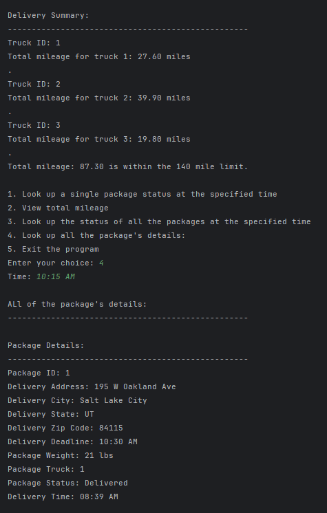

## Package Routing Optimizer

### Overview

This project is a Python-based logistics routing system designed to simulate and optimize package delivery operations. The application calculates efficient delivery routes while ensuring all packages are delivered on time under given constraints.

### Key Features

* Optimized delivery routing using a nearest-neighbor algorithm
* Custom hash table implementation for efficient package lookup
* Real-time tracking of package status and delivery times
* Distance calculations based on a provided distance matrix
* Simulation of multiple delivery trucks with time and capacity constraints

### Technologies Used

* Python
* Data Structures (Hash Tables)
* Algorithms (Greedy / Nearest Neighbor)
* CSV Data Processing

### Problem Solved

This project addresses the challenge of optimizing delivery routes under constraints such as package deadlines, truck capacity, and travel distances. It demonstrates how algorithmic decision-making can improve efficiency in logistics operations.

### Key Concepts Demonstrated

* Algorithm design and optimization
* Data structure implementation from scratch
* Time complexity and performance considerations
* Object-oriented programming
* Real-world problem modeling

### How to Run

1. Clone the repository:

   ```
   git clone https://github.com/ShellyMyatt/package-routing-optimizer.git
   ```

2. Navigate to the project directory:

   ```
   cd package-routing-optimizer/routing_app
   ```

3. Run the program:

   ```
   python main.py
   ```

4. Follow the prompts in the console to view delivery status and routing information.

### Example Output

Below is an example of the program output showing delivery routing results and package status:



